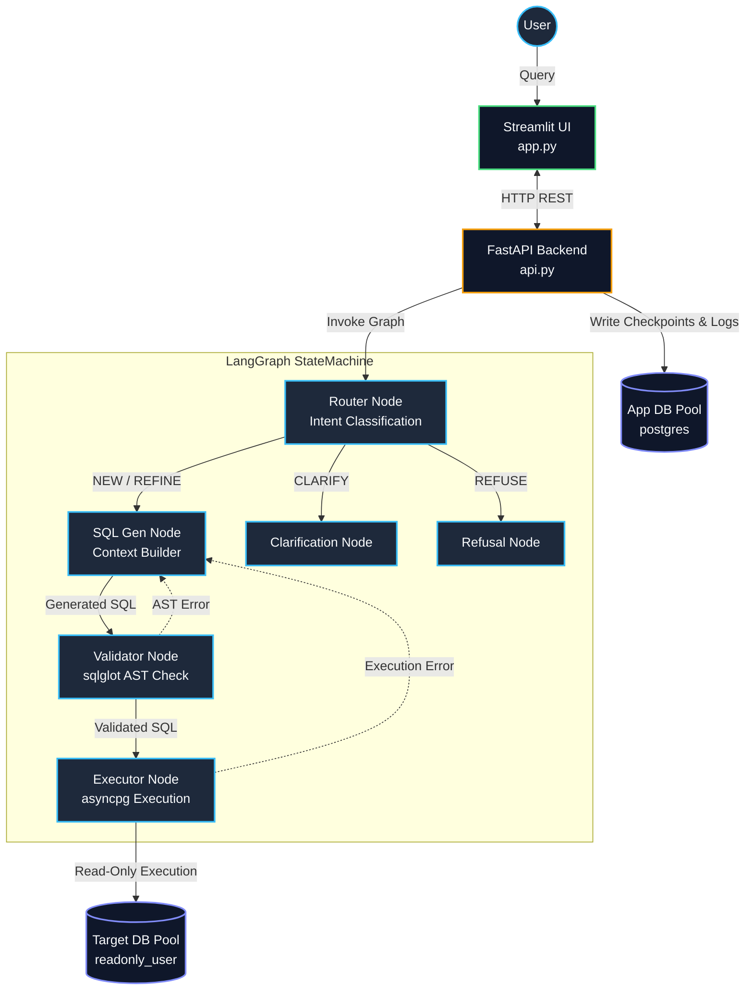

# Conversational Text-to-SQL Agent Architecture

## 1. Executive Summary
This repository contains a production-grade, stateful Conversational Text-to-SQL agent built specifically for a target PostgreSQL database. It translates natural language into robust, secure PostgreSQL queries using a constrained agentic workflow, maintaining persistent multi-turn conversational memory, filtering semantics, and dynamic state tracking.

## 2. Technology Stack
- **Core Orchestration**: LangGraph (StateGraph)
- **Language Model**: Ollama (Qwen2.5-Coder-7B) via `langchain_core`
- **Backend API**: FastAPI (Decoupled execution layer)
- **Database Connectivity**: `asyncpg` (Asynchronous PostgreSQL client)
- **SQL Parsing & Guardrails**: `sqlglot`
- **Frontend / UI**: Streamlit (`app.py`)
- **State & Analytics Persistence**: PostgreSQL (LangGraph Checkpointer, `chat_history`, `system_errors`)

## 3. Architecture Diagram

## 4. Decoupled API & Dual-Pool Isolation
To ensure production-grade security and performance, the architecture is strictly decoupled:

1. **FastAPI Backend**: The Streamlit UI is a thin, dumb presentation layer. All heavy lifting, LangGraph execution, and asynchronous task management is offloaded to a non-blocking FastAPI backend. 
2. **Dual-Pool Database Security**:
   - **App Pool (`postgres` admin)**: The FastAPI backend connects to the database via an admin pool to write LangGraph state checkpoints, record `chat_history` analytics, and log full stack traces into `system_errors`.
   - **Target Pool (`readonly_user`)**: The LLM's dynamic queries are exclusively executed via a deeply restricted connection pool. The `readonly_user` role has a strictly enforced 3000ms statement timeout and is explicitly whitelisted to SELECT from only 7 target tables. The LLM physically cannot read system tables or user telemetry.

## 5. Chat History & State Persistence
The architecture guarantees persistent, resumable multi-turn conversations:

1. **PostgreSQL Checkpointer**: Every state transition inside LangGraph is persisted. If a user selects a previous session from the UI dropdown, the `AsyncPostgresSaver` hydrates the graph with the exact historical state (the last generated queries, semantic filters, and chat messages).
2. **Context Bounding**: To prevent context drift and LLM hallucination, `state.py` dynamically bounds the raw conversational history passed to the LLM to the most recent 4 turns (8 messages), while preserving the extracted semantic context (like `topic` and `filters`) infinitely.

## 6. Security & Guardrails (Outside the Model)
A dedicated AST validation layer using `sqlglot` sits strictly between the LLM and the Database Executor to enforce:
- **Operation Allowlisting**: Blocks all destructive operations (DROP, DELETE, UPDATE, INSERT, TRUNCATE, EXECUTE) and exclusively permits SELECT, UNION, and INTERSECT.
- **Dynamic Bounding**: Injects a `LIMIT 100` clause dynamically at the AST level if the generated query lacks one, preventing unbounded result sets.
- **Wildcard Throttling**: Parses the syntax tree to detect and block excessively broad `ILIKE '%a%'` operations.

## 7. Evaluation Harness (`eval/run_eval.py`)
A custom Python execution harness designed to benchmark LLM accuracy deterministically against a Golden Dataset:
- **Multiset (Bag) Evaluation**: Normalizes result sets into hashed tuples, mathematically proving semantic equivalence regardless of arbitrary column aliasing or projection ordering.
- **AST Normalization**: Utilizes a hybrid `sqlglot` injector to transfer arbitrary `LIMIT` and `ORDER BY` bounds from the LLM to the Gold queries on the fly, eliminating false-positive failures without masking explicit sorting constraints.
- **Telemetry**: Records per-conversation latency, token counts, and operational intent accuracy.

## 8. Evolution from the Proposed Architecture
During the implementation phase, the initial architectural diagram was rigorously evaluated and evolved to improve security, fault tolerance, and developer velocity. The core DAG flow (Router → Generator → Validator → Executor ↺) was preserved, but the infrastructure around it was upgraded:

### 1. Redis State Manager ➡️ LangGraph + PostgreSQL Checkpointer
- **Initial Proposal**: Use a dedicated Redis instance to manage conversational state, history, and active context.
- **Final Implementation**: We adopted **LangGraph** to natively orchestrate the cyclic DAG (handling the retry loops automatically) and used its native **PostgreSQL Checkpointer** for state persistence.
- **Why**: LangGraph eliminated the need to write custom boilerplate for `while` loops and state merging. By backing it with PostgreSQL instead of Redis, we reduced infrastructure complexity (removing a dependency) while gaining durable, out-of-the-box "Time-Travel" session hydration. Redis was briefly considered for the UI sidebar, but ultimately we consolidated entirely on Postgres for absolute consistency.

### 2. Single Database Node ➡️ Dual-Pool Security Isolation
- **Initial Proposal**: A singular `PostgreSQL DB` node that the `SQL Executor` queries.
- **Final Implementation**: We split the database access layer into two strictly isolated connection pools (`app_pool` and `target_pool`).
- **Why**: If the LLM generates a malicious or hallucinated query, it absolutely cannot run with the same privileges as our application. The `app_pool` (admin) handles writing LangGraph checkpoints, telemetry, and error traces. The `target_pool` (`readonly_user`) is locked down to 7 specific tables and enforced with a 3000ms query timeout, effectively sandboxing the LLM physically at the database level.

### 3. "Graceful Degradation" ➡️ Dedicated Telemetry Tables
- **Initial Proposal**: The graph flows to a "Graceful Degradation / Error Message" node when unrecoverable.
- **Final Implementation**: We expanded this concept into a full **Observability Layer**.
- **Why**: Simply showing a polite error to the user is insufficient for debugging an LLM pipeline. We built asynchronous background workers in FastAPI that catch these unrecoverable errors and dump the full Python stack traces directly into a `system_errors` table in PostgreSQL. We also built a `chat_history` table to record exact token usage, latency (ms), and the generated SQL for every single turn, giving us a perfect audit trail.
